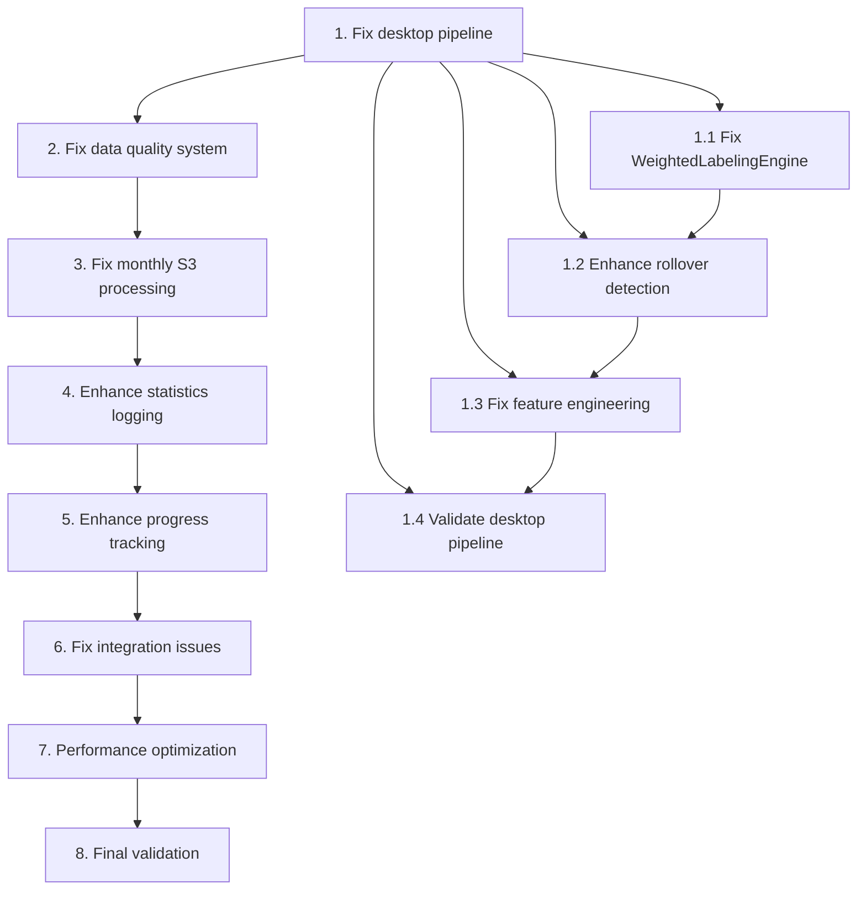

# Implementation Plan - Data Processing Validation and Monthly S3 Processing

## Overview

This implementation plan focuses on fixing and enhancing the existing data processing pipeline to enable reliable validation and monthly S3 processing. The tasks build incrementally on the existing codebase, fixing issues and adding enhancements without rebuilding from scratch.

## Task List

- [x] 1. Fix and validate existing desktop pipeline

  - Fix any issues in WeightedLabelingEngine that prevent reliable processing
  - Enhance rollover detection in LabelCalculator._detect_contract_rolls() method
  - Fix memory management issues in chunked processing
  - Validate test_30day_pipeline.py works end-to-end without errors
  - _Requirements: 1.1, 1.2, 1.3, 1.4_

- [x] 1.1 Fix WeightedLabelingEngine memory and performance issues

  - Debug and fix memory leaks in _process_chunked() method
  - Optimize vectorized calculations in _calculate_weights_vectorized()
  - Fix any issues with garbage collection between processing stages
  - Ensure peak memory usage stays under 8GB for large datasets
  - _Requirements: 1.1, 6.1, 6.3_

- [x] 1.2 Enhance rollover detection and handling

  - Review and fix _detect_contract_rolls() method for edge cases
  - Ensure 20-point price gap threshold works correctly
  - Fix logic for marking rollover bar and following 5 bars as affected
  - Add comprehensive rollover statistics collection
  - Validate rollover events are properly excluded from training (label=0)
  - _Requirements: 1.3, 4.1, 4.2, 4.3, 4.4_

- [x] 1.3 Fix feature engineering validation and error handling

  - Debug and fix any NaN handling issues in rolling calculations
  - Add feature value range validation for all 43 features
  - Improve error recovery for individual feature categories
  - Ensure feature distributions are consistent and reasonable
  - _Requirements: 1.2, 5.4_

- [x] 1.4 Validate and fix desktop testing pipeline

  - Fix any issues in test_30day_pipeline.py that prevent successful execution
  - Ensure validate_full_dataset_logic.py produces consistent results
  - Fix integration between WeightedLabelingEngine and feature engineering
  - Validate complete pipeline runs in under 10 minutes on desktop sample
  - _Requirements: 1.4, 1.5, 1.7, 10.6_

- [x] 1.5 Add comprehensive desktop validation reporting

  - Create validation report showing data quality metrics
  - Add rollover statistics and affected bar counts
  - Include feature quality metrics and NaN percentages
  - Generate summary of win rates and weight distributions
  - _Requirements: 1.7_

- [x] 2. Fix and enhance data quality validation system

  - Fix any remaining issues in clean_price_data() function
  - Enhance InputDataFrame and OutputDataFrame validation
  - Improve timezone handling for RTH filtering
  - Add better outlier detection and handling
  - _Requirements: 5.1, 5.2, 5.3, 5.4_

- [x] 2.1 Fix and enhance price data cleaning

  - Review and fix any edge cases in clean_price_data() function
  - Improve OHLC relationship validation logic
  - Add better price range validation for ES futures
  - Enhance volume validation and negative value handling
  - _Requirements: 5.1_

- [x] 2.2 Fix timezone and RTH filtering issues

  - Fix any DST transition issues in existing timezone conversion
  - Validate Central Time conversion works correctly year-round
  - Ensure RTH filtering (07:30-15:00 CT) is accurate
  - Validate expected 30-40% data reduction from RTH filtering
  - _Requirements: 5.2_

- [x] 2.3 Enhance OutputDataFrame validation system

  - Fix any issues in validate_quality_assurance() method
  - Improve binary label validation (ensure only 0 or 1 values)
  - Enhance positive weight validation
  - Fix win rate range validation (5-50% per mode)
  - Add detection for NaN or infinite values in output
  - _Requirements: 5.3_

- [x] 2.4 Add feature validation and outlier detection

  - Validate all 43 expected features are generated correctly
  - Add feature value range validation based on expected distributions
  - Implement outlier detection for extreme feature values
  - Ensure NaN percentages stay below 35% threshold for rolling features
  - _Requirements: 5.4_

- [x] 3. Fix and enhance monthly S3 processing pipeline

  - Fix any issues in process_monthly_chunks_fixed.py
  - Enhance S3 file discovery and path handling
  - Improve error handling and retry logic
  - Add comprehensive statistics collection for each month
  - _Requirements: 2.1, 2.2, 2.3, 2.4, 2.5, 2.6, 2.7_

- [x] 3.1 Fix S3 integration and file discovery

  - Fix S3 file discovery to handle different path structures
  - Improve download_monthly_file() with better error handling
  - Add retry logic for transient S3 errors (network, throttling)
  - Validate S3 file integrity before processing
  - _Requirements: 2.2, 7.3, 7.4_

- [x] 3.2 Enhance monthly processing workflow

  - Fix any issues in process_monthly_data() function
  - Improve integration with WeightedLabelingEngine and feature engineering
  - Add better memory management between processing stages
  - Ensure each month processes independently for restart capability
  - _Requirements: 2.1, 2.5, 6.2_

- [x] 3.3 Improve error handling and recovery

  - Enhance try/catch blocks in process_single_month() to continue on failures
  - Improve log_progress() function to capture detailed error information
  - Add retry logic for corrupted or incomplete monthly files
  - Enhance error messages for different failure types
  - _Requirements: 7.1, 7.2, 7.5, 7.6_

- [x] 3.4 Add comprehensive monthly statistics collection

  - Enhance OutputDataFrame.get_statistics() to include processing metrics
  - Add rollover event tracking and statistics per month
  - Include feature quality metrics and data quality flags
  - Add processing time and memory usage tracking
  - _Requirements: 3.1, 3.2, 3.4, 3.5_

- [x] 4. Enhance statistics logging and S3 metadata

  - Build comprehensive monthly statistics system
  - Save statistics as JSON metadata in S3
  - Add quality scoring and reprocessing recommendations
  - Create monthly quality reports
  - _Requirements: 3.1, 3.2, 3.3, 3.6_

- [x] 4.1 Create comprehensive statistics data model

  - Define MonthlyProcessingStatistics dataclass with all required fields
  - Include rollover events, data quality metrics, and processing stats
  - Add mode-specific statistics (win rates, weights, quality flags)
  - Include feature engineering statistics and quality scores
  - _Requirements: 3.1_

- [x] 4.2 Enhance S3 metadata and storage

  - Improve upload_monthly_results() to include comprehensive metadata
  - Save monthly statistics as separate JSON files in S3
  - Add quality flags and reprocessing recommendations to metadata
  - Organize output files with consistent naming and compression
  - _Requirements: 3.2, 8.5, 8.6_

- [x] 4.3 Add quality scoring and validation

  - Implement quality scoring algorithm based on multiple factors
  - Add automated detection of months requiring reprocessing
  - Validate win rates are within reasonable ranges (5-50% per mode)
  - Flag months with excessive rollover events or data quality issues
  - _Requirements: 3.3, 3.4, 3.6_

- [x] 4.4 Create monthly quality reporting system

  - Generate comprehensive quality reports for each processed month
  - Create summary reports across multiple months
  - Add trend analysis for data quality over time
  - Include recommendations for reprocessing specific months
  - _Requirements: 3.2, 3.6_

- [x] 5. Enhance progress tracking and monitoring

  - Improve existing progress tracking in monthly processing
  - Add better time estimation and bottleneck identification
  - Enhance logging and monitoring capabilities
  - Create final processing report generation
  - _Requirements: 9.1, 9.2, 9.3, 9.4, 9.5, 9.6, 9.7_

- [x] 5.1 Improve progress tracking and time estimation

  - Enhance existing progress tracking in main() for 180+ months
  - Improve time estimation logic based on completed months
  - Add stage timing to identify processing bottlenecks
  - Calculate and display average processing time per month
  - _Requirements: 9.1, 9.2, 9.4_

- [x] 5.2 Enhance logging and monitoring system

  - Improve log_progress() function with better timestamp and detail capture
  - Add processing start/end times for each month and stage
  - Create comprehensive processing log with success/failure status
  - Add memory usage and performance monitoring
  - _Requirements: 9.3, 7.7_

- [x] 5.3 Create final processing report generation

  - Generate comprehensive final report with processing statistics
  - Include summary of successful vs failed months
  - Add data quality summary across all processed months
  - Create recommendations for any required reprocessing
  - _Requirements: 9.6, 9.7_

- [ ] 6. Fix integration issues and ensure consistency
  - Fix any import or compatibility issues between components
  - Ensure consistent results between desktop and S3 processing
  - Validate configuration parameters work correctly
  - Fix any functionality regressions
  - _Requirements: 10.1, 10.2, 10.3, 10.4, 10.5, 10.6, 10.7_

- [ ] 6.1 Fix component integration issues
  - Fix any import errors or compatibility issues with WeightedLabelingEngine
  - Resolve integration issues between monthly processing and feature engineering
  - Fix any configuration parameter issues
  - Ensure all existing functionality is preserved
  - _Requirements: 10.1, 10.2, 10.4, 10.5_

- [ ] 6.2 Validate consistency between desktop and S3 processing
  - Ensure desktop validation logic works with monthly processing
  - Fix any inconsistencies in results between desktop and S3 processing
  - Validate same data produces identical results in both environments
  - Test end-to-end consistency with sample data
  - _Requirements: 10.6, 10.7_

- [ ] 7. Performance optimization and memory management
  - Optimize memory usage in WeightedLabelingEngine
  - Improve S3 operations with compression and retry logic
  - Add memory monitoring and cleanup
  - Optimize processing order to minimize memory fragmentation
  - _Requirements: 6.1, 6.4, 6.6, 6.7_

- [ ] 7.1 Optimize memory usage and monitoring
  - Fix memory leaks in WeightedLabelingEngine chunked processing
  - Add memory monitoring with automatic cleanup triggers
  - Optimize processing order to minimize memory fragmentation
  - Ensure peak memory usage stays under 8GB
  - _Requirements: 6.1, 6.4, 6.7_

- [ ] 7.2 Optimize S3 operations and file handling
  - Add Parquet compression optimization for S3 storage
  - Implement retry logic with exponential backoff for S3 operations
  - Optimize file upload/download with progress tracking
  - Add file integrity validation before and after S3 operations
  - _Requirements: 8.4, 7.3, 8.7_

- [ ] 7.3 Add comprehensive performance monitoring
  - Create performance monitoring system for all processing stages
  - Add bottleneck identification and optimization recommendations
  - Monitor memory usage patterns and optimize accordingly
  - Generate performance reports for optimization planning
  - _Requirements: 6.5, 9.5_

- [ ] 8. Final validation and deployment preparation
  - Run comprehensive end-to-end validation
  - Test error recovery and retry mechanisms
  - Validate complete monthly processing workflow
  - Prepare deployment documentation and procedures
  - _Requirements: All requirements validation_

- [ ] 8.1 Run comprehensive end-to-end validation
  - Test complete desktop pipeline with all fixes
  - Validate single month processing works correctly
  - Test error recovery with corrupted data and network issues
  - Ensure all statistics collection and reporting works
  - _Requirements: 1.4, 1.7, 7.1, 7.2_

- [ ] 8.2 Test monthly processing at scale
  - Process multiple months to test scalability
  - Validate memory management works for extended processing
  - Test S3 integration with retry logic and error handling
  - Ensure statistics collection works across multiple months
  - _Requirements: 2.1, 2.5, 6.2, 7.3_

- [ ] 8.3 Validate data quality and consistency
  - Run data quality validation across processed months
  - Ensure rollover detection works correctly across different time periods
  - Validate feature engineering consistency across months
  - Test win rate and weight distribution validation
  - _Requirements: 3.4, 3.5, 4.1, 4.2, 5.3_

- [ ] 8.4 Create deployment documentation and procedures
  - Document fixed issues and enhancements made
  - Create deployment procedures for monthly processing
  - Document monitoring and alerting procedures
  - Create troubleshooting guide for common issues
  - _Requirements: 9.7_

## Task Dependencies

## Success Criteria

- [ ] Desktop pipeline (test_30day_pipeline.py) runs successfully without errors
- [ ] Monthly processing can handle single month end-to-end
- [ ] All data quality validation passes
- [ ] Statistics collection and logging works correctly
- [ ] Memory usage stays under 8GB during processing
- [ ] Error handling and retry logic works for S3 operations
- [ ] Rollover detection properly excludes affected bars
- [ ] Feature engineering generates all 43 features correctly
- [ ] Win rates for all 6 modes are within 5-50% range
- [ ] Processing time per month is under 30 minutes

## Estimated Timeline

- **Phase 1 (Tasks 1-2)**: Fix desktop pipeline and data quality - 2-3 days
- **Phase 2 (Tasks 3-4)**: Fix monthly processing and statistics - 3-4 days  
- **Phase 3 (Tasks 5-6)**: Enhance monitoring and fix integration - 2-3 days
- **Phase 4 (Tasks 7-8)**: Optimize performance and final validation - 2-3 days

**Total Estimated Time**: 9-13 days

This implementation plan focuses on systematically fixing and enhancing your existing codebase to achieve reliable data processing validation and monthly S3 processing capabilities.