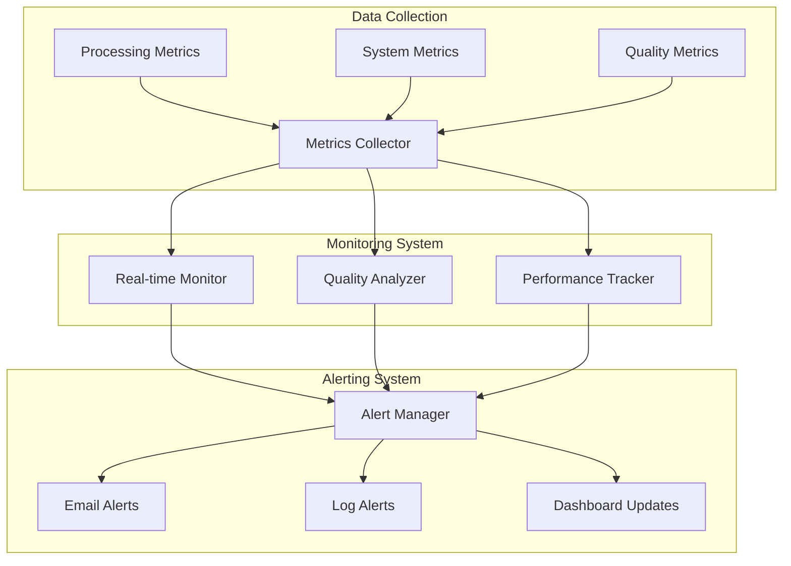

# Monitoring and Alerting Procedures

## Overview

This document outlines comprehensive monitoring and alerting procedures for the enhanced data processing pipeline. The system monitors processing performance, data quality, system resources, and automatically alerts on issues requiring attention.

## Monitoring Architecture

## Key Performance Indicators (KPIs)

### 1. Processing Performance Metrics

#### Primary Metrics
- **Processing Time per Month**: Target < 30 minutes
- **Memory Usage**: Peak < 8GB
- **CPU Utilization**: Average < 80%
- **Disk I/O**: Read/Write throughput
- **Network I/O**: S3 transfer rates

#### Secondary Metrics
- **Garbage Collection Frequency**: GC events per hour
- **Chunk Processing Rate**: Chunks per minute
- **Error Rate**: Errors per 1000 operations
- **Retry Success Rate**: Successful retries percentage

### 2. Data Quality Metrics

#### Core Quality Indicators
- **Win Rate Range**: 5-50% for all 6 modes
- **Feature NaN Percentage**: < 35% for rolling features
- **Quality Score**: > 0.8 (80%)
- **Rollover Detection Accuracy**: Manual validation required

#### Data Integrity Metrics
- **Column Count**: Exactly 61 columns (6 + 12 + 43)
- **Row Count Consistency**: Expected rows per month
- **Data Type Validation**: All columns correct types
- **Value Range Validation**: All values within expected ranges

### 3. System Health Metrics

#### Resource Utilization
- **Available Memory**: > 4GB free
- **Disk Space**: > 100GB free on processing drives
- **Network Connectivity**: S3 response time < 5 seconds
- **Process Health**: All required processes running

## Monitoring Implementation

### 1. Real-time Processing Monitor

Create the monitoring script:

<function_calls>
<invoke name="fsWrite">
<parameter name="path">monitor_processing.py